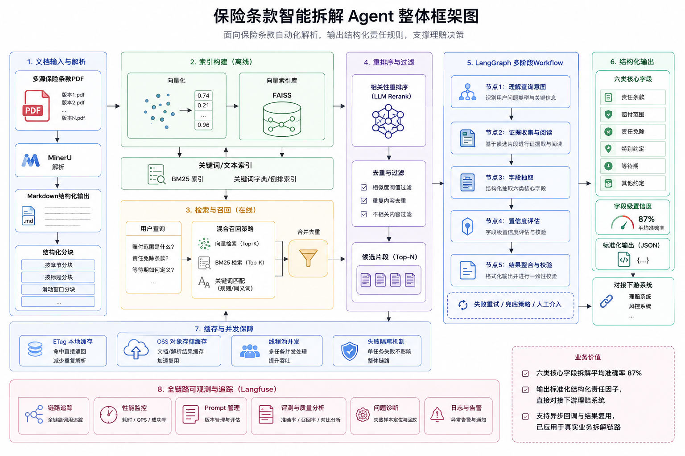

# 保险条款拆解服务

<p align="center">
  面向保险条款的 PDF 理解、混合检索与结构化责任拆解服务
</p>

<p align="center">
  
  
  
  
  
</p>

本服务将保险条款、特别约定等 PDF 文档转换为可计算的结构化数据。它组合了 PDF 解析、Markdown 结构化、向量与 BM25 混合检索、LLM 工作流、字段级置信度评估，以及 OSS/MySQL/Redis 等工程能力，输出责任范围、医院范围、费用类型、等待期、既往症和责任免除等结果。



> [!IMPORTANT]
> 项目正在进行开源化整理，接口和数据模型仍可能调整。请勿直接将模型输出用于自动理赔或承保决策；高风险业务场景应保留人工审核、规则校验和完整审计链路。

## 为什么使用它

- **开箱即用的本地体验**：仓库提供中文示例 PDF、端到端脚本，以及本地 Redis/MySQL Compose 环境。
- **兼容多种模型网关**：聊天与 Embedding 均支持 OpenAI-compatible API，可替换具体模型供应商。
- **面向复杂保险条款**：按计划、条款、责任拆解赔付范围、等待期、既往症、责免和置信度。
- **目录检索 + 混合检索**：结合 Markdown 目录索引、FAISS 向量检索、BM25 和字符串匹配，降低单一路径漏召回。
- **缓存优先**：以文件名和 OSS ETag 生成签名，优先复用本地或 OSS 中的文档与向量缓存。
- **工程集成完整**：包含异步 API、并行责任处理、OSS 缓存、MySQL 中间结果、Redis token 轮转及可选 Langfuse 追踪。

## 能力范围

| 能力 | 当前实现 |
| --- | --- |
| PDF 解析 | PDFium 本地文本提取；MinerU 云端解析可用于扫描件/OCR 场景 |
| 文档结构化 | Markdown 目录、分块、索引和文件级缓存 |
| 检索 | FAISS、BM25、字符串匹配、LLM 相关性校验 |
| 条款拆解 | 赔付场景、事故类型、治疗类型、医院范围、费用范围、发票规则 |
| 判责参数 | 等待期、既往症、特定疾病既往症、自定义规则 |
| 责任免除 | 目录索引与向量召回并集后进行免责实体提取 |
| 质量信号 | 医院、发票、等待期、既往症等字段级置信度评估 |
| 基础设施 | OSS、MySQL、Redis、本地缓存、可选 Langfuse |

## 快速开始

### 1. 准备环境

推荐配置：

- Python 3.11
- Docker Desktop 或兼容 Docker Engine
- 可访问的 OpenAI-compatible Chat 和 Embedding API
- 一个可用的阿里云 OSS Bucket

> 当前演示脚本会将示例 PDF 上传至 OSS，再通过与生产流程相同的 ETag 与缓存路径执行拆解，因此 OSS 是端到端演示的必要配置。Redis 和 MySQL 默认运行在本机。

### 2. 安装依赖

```bash
git clone <仓库地址>
cd <项目目录>

python3.11 -m venv .venv
source .venv/bin/activate
python -m pip install --upgrade pip
python -m pip install -r requirements.txt
```

Windows PowerShell 激活虚拟环境：

```powershell
.venv\Scripts\Activate.ps1
```

### 3. 配置环境变量

```bash
cp .env.example .env.local
```

至少填写以下项目：

```dotenv
OPENAI_API_BASE=https://your-gateway.example/v1
OPENAI_API_KEY=replace-me
OPENAI_CHAT_MODEL=your-chat-model
OPENAI_EMBEDDING_MODEL=your-embedding-model

APP_OSS_REGION=cn-hangzhou
APP_OSS_ACCESS_KEY_ID=replace-me
APP_OSS_ACCESS_KEY_SECRET=replace-me
APP_OSS_BUCKET_NAME=replace-me
```

`.env.local` 已被 Git 忽略。不要将 API Key、数据库密码或 OSS 凭证提交到仓库。

### 4. 启动本地 Redis 和 MySQL

```bash
docker compose -f compose.local.yaml up -d --wait
docker compose -f compose.local.yaml ps
```

Compose 会创建：

- Redis：`127.0.0.1:6379`
- 本地 MySQL：`127.0.0.1:3306`（数据库名由 `APP_TEST_DB_NAME` 指定）
- Knowledge MySQL：`127.0.0.1:3306/clausemind_knowledge`
- 拆解中间结果所需的 MySQL 表

数据保存在 Docker 命名卷中。停止服务但保留数据：

```bash
docker compose -f compose.local.yaml down
```

### 5. 运行端到端示例

仓库内置了 [`examples/demo_policy.pdf`](examples/demo_policy.pdf)：

```bash
python scripts/run_local_demo.py
```

成功时会输出：

```text
LOCAL_DEMO_OK result=.../examples/demo_result.json
```

结构化结果位于 `examples/demo_result.json`，该文件默认不会提交到 Git。

### 6. 启动 API

```bash
uvicorn app.main:app --host 0.0.0.0 --port 8080
```

启动后可访问：

- 健康检查：<http://127.0.0.1:8080/health>
- Swagger UI：<http://127.0.0.1:8080/docs>
- ReDoc：<http://127.0.0.1:8080/redoc>

## 处理架构

```mermaid
---
config:
  theme: base
  themeVariables:
    background: "#FFFFFF"
    primaryColor: "#EFF6FF"
    primaryTextColor: "#172033"
    primaryBorderColor: "#7AA2E3"
    lineColor: "#64748B"
    secondaryColor: "#F0FDF4"
    tertiaryColor: "#FFF7ED"
---
flowchart LR
    Client["API 调用方"] -->|"POST 请求"| API["FastAPI"]
    API -->|"立即返回已接收"| Client
    API -->|"后台任务"| Normalize["下载文件并上传 OSS"]

    subgraph Document["文档理解"]
        direction TB
        Normalize --> Signature["读取 OSS ETag<br/>生成缓存签名"]
        Signature --> Cache{"缓存命中?"}
        Cache -->|"本地或 OSS 命中"| Artifacts["加载 Markdown、Chunks、FAISS"]
        Cache -->|"未命中"| Parser{"PDF 解析模式"}
        Parser -->|"local"| PDFium["PDFium<br/>可搜索 PDF"]
        Parser -->|"mineru"| MinerU["MinerU<br/>扫描件与复杂版面"]
        MinerU -.->|"token 轮转"| Redis["Redis"]
        Redis -.->|"不可用时降级"| Memory["进程内 token 状态"]
        PDFium --> Markdown["Markdown 结构化与分块"]
        MinerU --> Markdown
        Markdown --> Embed["Embedding"]
        Embed --> Index["FAISS + BM25 缓存"]
        Index -->|"本地持久化并备份 OSS"| Artifacts
    end

    Artifacts --> Parallel["按计划 / 条款 / 责任并行"]

    subgraph Workflow["LangGraph 责任拆解"]
        direction TB
        Parallel --> Prepare["准备状态"]
        Prepare --> Agreement["特别约定召回"]
        Agreement --> Liability["责任条款召回"]
        Liability --> Base["基础赔付场景"]
        Base --> Multi["多场景赔付规则"]
        Multi --> Waiting["等待期"]
        Waiting --> Past["既往症"]
        Past --> Exclusion["责任免除"]
        Exclusion --> Confidence["字段级置信度"]
    end

    Confidence --> Result["结构化响应"]
    Parallel -.->|"单项失败时隔离为空结果"| Result
    Result -->|"可选"| MySQL["MySQL 中间结果"]
    Result -->|"可选异步回调"| Callback["业务系统"]

    classDef entry fill:#E0F2FE,stroke:#0284C7,color:#0C4A6E;
    classDef process fill:#DBEAFE,stroke:#2563EB,color:#172554;
    classDef decision fill:#FEF3C7,stroke:#D97706,color:#78350F;
    classDef storage fill:#DCFCE7,stroke:#16A34A,color:#14532D;
    classDef output fill:#CCFBF1,stroke:#0F766E,color:#134E4A;
    classDef external fill:#F3E8FF,stroke:#9333EA,color:#581C87;
    classDef fallback fill:#FEE2E2,stroke:#DC2626,color:#7F1D1D;

    class Client,API entry;
    class Normalize,Signature,PDFium,MinerU,Markdown,Embed,Index,Artifacts,Parallel,Prepare,Agreement,Liability,Base,Multi,Waiting,Past,Exclusion,Confidence process;
    class Cache,Parser decision;
    class Redis,MySQL storage;
    class Result output;
    class Callback external;
    class Memory fallback;

    style Document fill:#FFFFFF,stroke:#BFDBFE,stroke-width:1px
    style Workflow fill:#FFFFFF,stroke:#C4B5FD,stroke-width:1px
```



图中的 API 路径会先返回“报文已接收”，实际拆解在 FastAPI BackgroundTasks 中执行。端到端示例脚本则直接调用服务层并等待最终 JSON，便于本地验证。

## 文档解析模式

通过 `PDF_PARSER_MODE` 选择解析器：

| 模式 | 适用场景 | 外部依赖 | 说明 |
| --- | --- | --- | --- |
| `local` | 文本型、可搜索 PDF | `pypdfium2` | 启动快，适合本地体验；不提供 OCR |
| `mineru` | 扫描件、表格、复杂版面 | MinerU Token，可选 Redis | 轮询云端任务；Redis 不可用时 token 轮转降级为进程内状态 |

MinerU 配置示例：

```dotenv
PDF_PARSER_MODE=mineru
MINERU_TOKEN_1=replace-me
MINERU_TOKEN_2=replace-me
MINERU_USE_REDIS=true
```

## API

### 健康检查

```http
GET /health
```

```json
{"status": "healthy"}
```

### 新版条款拆解接口

```http
POST /deconstruct/request
Content-Type: application/json
```

精简请求示例：

```json
{
  "productInfo": {
    "id": 1,
    "orgCode": "DEMO",
    "policyType": "1",
    "groupPolicyNo": null,
    "planList": [
      {
        "id": 1,
        "planCode": "PLAN_001",
        "planName": "医疗计划",
        "planVersion": "1.0",
        "clauseCode": "CLAUSE_001",
        "clauseName": "医疗保险条款",
        "liabilityList": [
          {"id": 1, "liabCode": "LIAB_001", "liabName": "住院医疗保险金"}
        ]
      }
    ],
    "fileList": [
      {
        "id": 1,
        "fileClass": "03",
        "fileFormat": "application/pdf",
        "fileUrl": "https://example.com/policy.pdf",
        "fileExternalUrl": "https://example.com/policy.pdf",
        "fileName": "policy.pdf"
      }
    ]
  },
  "transDate": 1786200000000,
  "transNo": "550e8400-e29b-41d4-a716-446655440000",
  "systemCode": "DEMO",
  "policyNo": "POLICY_001",
  "planIds": [1]
}
```

接口会立即返回接收确认：

```json
{
  "code": "200",
  "message": "550e8400-e29b-41d4-a716-446655440000-报文已接收，正在进行拆解"
}
```

后台任务完成后，可通过 `APP_TEST_DECONSTRUCTION_CALLBACK_URL` 配置回调地址。部署环境可使用 `APP_PRD_` 前缀。

### 兼容接口

`POST /disassemble/factor` 保留旧版请求模型和回调格式。新接入方优先使用 `/deconstruct/request`。

完整字段、码表和响应结构见 [`models/接口规范.md`](models/接口规范.md)。

## 结构化输出

新版结果以产品计划和保险责任为层级，核心字段包括：

```text
deconstructResult
└── planResultList[]
    ├── planCode / clauseCode
    ├── liabilityResultList[]
    │   ├── claimNature
    │   ├── medicalType
    │   ├── hospitalScopes[]
    │   ├── feeCategory
    │   ├── invoiceRules[]
    │   ├── sceneRules[]
    │   ├── payParam[]
    │   └── nonResponsibilityList[]
    └── nonResponsibilityList[]
```

`payParam` 使用规则码表达等待期、既往症等判责参数，字段级置信度会参与医院、发票、等待期和既往症结果的转换。

## 配置参考

配置优先从 `.env` 加载，再由 `.env.local` 覆盖。完整模板见 [`.env.example`](.env.example)。

### 模型与解析

| 变量 | 必需 | 默认值 | 说明 |
| --- | --- | --- | --- |
| `OPENAI_API_BASE` | 是 | 空 | OpenAI-compatible 根地址，通常以 `/v1` 结尾 |
| `OPENAI_API_KEY` | 是 | 空 | 网关密钥 |
| `OPENAI_CHAT_MODEL` | 是 | `openai/deepseek-v4-flash` | Chat Completions 模型名 |
| `OPENAI_EMBEDDING_MODEL` | 是 | `text-embedding-v4` | Embedding 模型名 |
| `OPENAI_MAX_TOKENS` | 否 | `2048` | 单次 Chat Completions 最大输出 token |
| `PDF_PARSER_MODE` | 否 | `mineru` | `local` 或 `mineru` |
| `MINERU_TOKEN_1/2` | MinerU 模式 | 空 | MinerU API token |

### 存储与服务

| 变量 | 必需 | 说明 |
| --- | --- | --- |
| `APP_OSS_REGION` | 是 | OSS Region |
| `APP_OSS_ACCESS_KEY_ID` | 是 | OSS AccessKey ID |
| `APP_OSS_ACCESS_KEY_SECRET` | 是 | OSS AccessKey Secret |
| `APP_OSS_BUCKET_NAME` | 是 | OSS Bucket |
| `APP_TEST_REDIS_*` | 本地默认已配置 | Redis 连接参数 |
| `APP_TEST_DB_*` | 本地默认已配置 | 本地 MySQL 连接参数 |
| `APP_TEST_KB_*` | 本地默认已配置 | KB MySQL 连接参数 |
| `SAVE_TO_DATABASE` | 否 | 是否保存拆解中间结果 |
| `GENERAL_KB_ENABLED` | 否 | 是否调用外部标签 HTTP 服务；本地默认关闭 |

### 追踪与回调

| 变量 | 默认值 | 说明 |
| --- | --- | --- |
| `TRACING_METHOD` | `none` | 设置为 `langfuse` 时启用追踪 |
| `LANGFUSE_SECRET_KEY` | 空 | Langfuse Secret Key |
| `LANGFUSE_PUBLIC_KEY` | 空 | Langfuse Public Key |
| `LANGFUSE_HOST` | 空 | Langfuse 服务地址 |
| `LANGFUSE_PROMPT_LABEL` | `latest` | Prompt 版本标签 |
| `APP_TEST_DECONSTRUCTION_CALLBACK_URL` | 空 | 新版接口结果回调 |
| `APP_TEST_CALLBACK_URL` | 空 | 兼容接口结果回调 |

当 Langfuse 未启用或远程 Prompt 不可用时，工作流回退到仓库内的本地 Prompt 配置。

## 缓存与持久化

本地缓存按 `policyNo/signature` 隔离：

```text
local_cache/{policy_no}/{signature}/
├── index.faiss
├── index.pkl
├── documents.pkl
├── chunks.json
├── metadata.json
├── {policy_no}_catalog.md
├── {policy_no}_parsed.md
└── {policy_no}_chunks.json
```

缓存策略：

1. 读取每个 OSS 对象的 ETag，并与文件名组合生成签名。
2. 优先验证本地 `index.faiss` 和 `index.pkl`。
3. 本地未命中时尝试从 OSS 下载同签名缓存。
4. 缓存仍未命中时解析 PDF、构建 Markdown/Chunks/向量索引。
5. 新缓存保存在本地并上传 OSS，供多实例复用。

MySQL 的 `demo_disassemble_service_middle_info` 保存请求、工作流中间结果和最终输出，便于调试与审计。Redis 当前用于 MinerU token 轮转；检索结果缓存和部分文档缓存仍是进程内或本地文件级实现。

## 项目结构

```text
<项目根目录>/
├── app/                         # FastAPI 入口与后台任务路由
├── infrastructure/              # MySQL、Redis、HTTP Session、线程池
├── models/                      # 新旧 Pydantic 模型与接口规范
├── repositories/                # OSS、数据库、Embedding、Langfuse 适配
├── vectorstore/                 # FAISS/BM25 混合检索与缓存管理
├── workflows/
│   ├── document_processing/     # PDF、Markdown、分块、向量库构建
│   ├── factor_disassembly/      # 服务编排与响应构建
│   └── policy_disassembly/      # LangGraph 条款拆解工作流
├── scripts/run_local_demo.py    # 同步端到端体验入口
├── examples/demo_policy.pdf     # 示例保险条款
├── docker/mysql/init/           # 本地 MySQL 初始化脚本
├── compose.local.yaml           # Redis + MySQL 本地环境
├── config.py                    # 统一配置
└── requirements.txt
```

## 开发指南

### 添加新的拆解节点

1. 在 `workflows/policy_disassembly/extract_general_audit_items.py` 定义节点输入与输出。
2. 扩展 `FlowState`，并将节点加入 `build_graph()` 的显式边序列。
3. 在 `repositories/langfuse_prompts_config.py` 增加本地 Prompt 回退配置。
4. 更新 `workflows/policy_disassembly/code_parsers.py`，将节点结果转换为稳定响应模型。
5. 使用示例 PDF 回归目录召回、向量召回、异常降级和最终 JSON。

### 本地验证

```bash
# Python 语法与导入检查
python -m compileall -q app infrastructure models repositories vectorstore workflows scripts

# Compose 配置检查
docker compose -f compose.local.yaml config -q

# 端到端回归
python scripts/run_local_demo.py

# API 健康检查
curl -fsS http://127.0.0.1:8080/health
```

### 生产部署提示

- Docker 镜像直接以 Uvicorn 启动应用；生产部署应由编排平台或进程管理器负责副本数、资源限制和日志采集。
- API 使用进程内 BackgroundTasks。需要跨进程重试、任务持久化或水平扩展时，建议接入独立任务队列。
- OSS、MySQL、Redis 和模型网关凭证应由 Secret Manager 或部署平台注入。
- 对外开放前应增加认证、请求大小限制、PDF 类型校验、回调签名与速率限制。

## 常见问题

<details>
<summary>为什么请求接口只返回“正在进行拆解”？</summary>

两个 POST 接口都会把任务加入 FastAPI BackgroundTasks，并立即返回接收确认。使用回调获取异步结果；本地调试可运行 `scripts/run_local_demo.py` 同步等待完整结果。
</details>

<details>
<summary>本地 PDF 解析为什么没有识别扫描件？</summary>

`PDF_PARSER_MODE=local` 使用 PDFium 提取已有文本层，不执行 OCR。扫描 PDF 或复杂版面请使用 `PDF_PARSER_MODE=mineru` 并配置有效 token。
</details>

<details>
<summary>为什么第一次运行较慢？</summary>

首次运行需要解析 PDF、调用 Embedding、构建 FAISS/BM25 缓存并执行多个 LLM 节点。相同文件和保单号再次运行时会优先复用签名缓存。
</details>

<details>
<summary>模型返回为空或触发重试怎么办？</summary>

确认模型支持 `/chat/completions`、网关模型名正确，并适当提高 `OPENAI_MAX_TOKENS`。部分 reasoning 模型可能把 token 消耗在隐藏推理中，导致正文为空。
</details>

## 开发计划

- [ ] 增加完全不依赖 OSS 的本地文件存储适配器
- [ ] 为 BackgroundTasks 增加可持久化任务队列和任务状态查询
- [ ] 补齐单元测试、端到端测试和 GitHub Actions
- [ ] 增加 API 鉴权、回调签名与安全基线
- [ ] 将内部码表与外部标签服务抽象为可插拔 Provider
- [ ] 提供轻量依赖组与完整 OCR 依赖组
- [ ] 增加英文文档和更多脱敏示例

## 参与贡献

欢迎提交 Issue 和 Pull Request。建议在提交前：

1. 说明使用场景、输入 PDF 类型与期望结构化结果。
2. 为行为变化提供可复现样例，样例不得包含真实客户数据或访问凭证。
3. 运行语法检查、Compose 检查和端到端示例。
4. 更新相关接口文档、配置模板和架构说明。

## 安全

- 不要提交 `.env`、`.env.local`、预签名 URL、客户保单或真实理赔资料。
- 示例和日志必须脱敏；生产环境建议关闭请求体全文日志。
- 如果发现安全问题，请通过仓库维护者提供的私密渠道报告，不要在公开 Issue 中披露凭证或客户数据。

## 开源许可证

本仓库尚未指定开源许可证。在根目录添加明确的 `LICENSE` 文件之前，默认保留所有权利。正式公开发布前请由项目所有者选择并确认合适的许可证。

## 致谢

项目构建于以下优秀开源生态之上：

- [FastAPI](https://github.com/fastapi/fastapi)
- [LangGraph / LangChain](https://github.com/langchain-ai/langgraph)
- [MinerU](https://github.com/opendatalab/MinerU)
- [FAISS](https://github.com/facebookresearch/faiss)
- [Langfuse](https://github.com/langfuse/langfuse)
